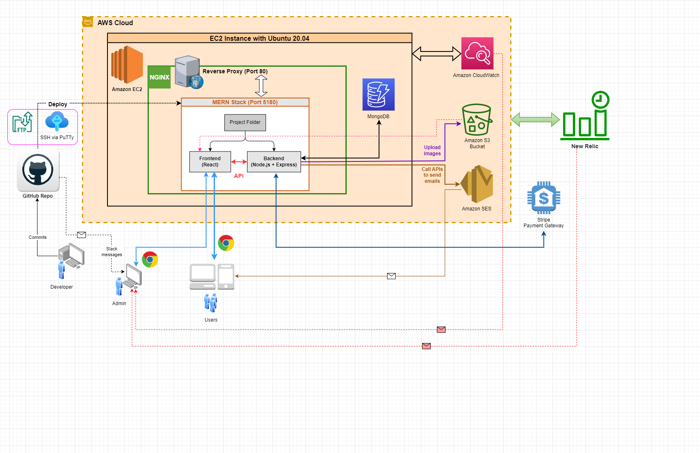
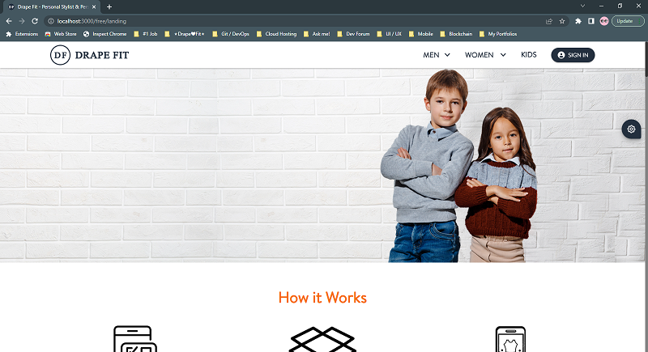
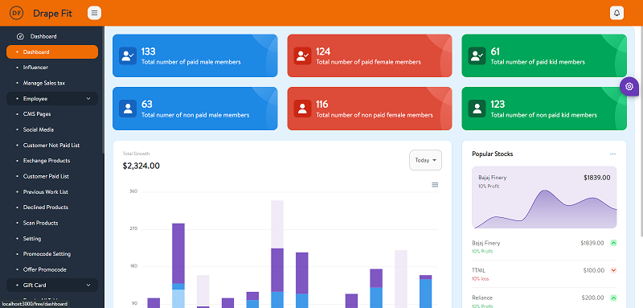
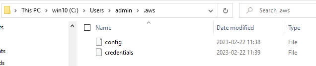

# drapefit-new-webapp

New version of **Drape Fit** Web App using `MERN`

## System Architecture Diagram



> This diagram is made using [draw.io](https://app.diagrams.net/)

## Pre-requisites

```yml
current release: v0.1.5
latest working: v0.1.6
```

```yml
node.js version: ^18.12.0
mongodb version: ^6.0.4
yarn version: ^1.22.4
```

Please refer to the `scripts` part of **./package.json** file:

```json
  "scripts": {
    "backend": "node --max-old-space-size=4096 backend/server.js",
    "backend:hotdev": "nodemon --max-old-space-size=4096 backend/server.js",
    "client": "npm start --prefix frontend",
    "dev": "concurrently \"npm run backend:hotdev\" \"npm run client\"",
    "test:server_mocha": "mocha -r esm backend/app.test.js --exit",
    "test:client_jest": "npm run test --prefix frontend",
    "test:c8": "npx c8 node backend/app.js",
    "test:c8_report": "npx c8 report && start \"\" \"coverage/index.html\"",
    "client:build": "npm run build --prefix frontend",
    "server:local": "npm run client:build && node --max-old-space-size=4096 backend/server.js",
    "server:ec2_dev": "pm2 start ecosystem.config.js --node-args=\"--experimental-loader newrelic/esm-loader.mjs --max-old-space-size=4096\"",
    "server:ec2_prod": "npm run client:build && pm2 start ecosystem.config.js --node-args=\"--experimental-loader newrelic/esm-loader.mjs --max-old-space-size=8192\""
  },
```

```bash
# Install node modules
$ yarn install

# Launch local live servers
$ yarn run dev

# Launch AWS EC2 remote server in development mode
$ yarn run server:ec2_dev

# Make backend unit test using Mocha
$ yarn run test:server_mocha
```

Visit

- http://localhost:5180/
- http://localhost:3000/





---

## User Authentication with Redux Toolkit

> Authentication workflow built with the MERN stack & Redux Toolkit.

### Features

- User Login/SignIn & SignUp
- Protected routes with React Router v6
- JWT storage with LocalStorage
- Automatically fetches user details on page load (Header.js)
- React Redux

### Usage

#### **Environment Variables**

`*.env` files are as the followings:

```path
> ./environments/dev.env
> ./environments/prod.env
```

```yaml
NODE_ENV=YOUR_NODE_ENV # development | production
## Ports
PORT=YOUR_PORT
PORT_REACT=YOUR_REACT_PORT
## MongoDB
MONGO_URI_MAIN=YOUR_MONGO_URI_MAIN
MONGO_URI_INVENTORY=YOUR_MONGO_URI_INVENTORY
MONGO_URI_SUPPLIER=YOUR_MONGO_URI_SUPPLIER
MONGO_URI_MERCHANDISE=YOUR_MONGO_URI_MERCHANDISE
## Secrets / Keys
JWT_SECRET=YOUR_JWT_SECRET
BEARER_TOKEN_PREFIX=YOUR_BEARER_TOKEN_PREFIX
## AWS Server
SERVER_IP=YOUR_SERVER_IP
SERVER_DOMAIN=YOUR_SERVER_DOMAIN
AWS_REGION=YOUR_AWS_REGION
S3_BUCKET_NAME=YOUR_S3_BUCKET_NAME
## Multer Upload
MULTER_DEST_DIR=YOUR_MULTER_DEST_DIR
## Email
DRAPEFIT_SVC_MAIL=YOUR_DRAPEFIT_SVC_MAIL
SUPER_ADMIN_EMAIL=YOUR_SUPER_ADMIN_EMAIL
SUPER_ADMIN_INITPWD=SUPER_ADMIN_INITIAL_PASSWORD
## Payment - Stripe
STRIPE_TEST_SK=YOUR_STRIPE_TEST_SECRET_KEY
STRIPE_LIVE_SK=YOUR_STRIPE_LIVE_SECRET_KEY
STRIPE_ENDPT_SECRET=YOUR_STRIPE_ENDPOINT_SECRET
```

#### **Frontend (React) Config Variables**

```path
frontend/src/configs/MyEnvConfig.js
```

`MyEnvConfig.js` file is as below:

```javascript | es6
export default {
  baseurl: {
    dev: 'YOUR_DEV_BASEURL',
    prod: 'YOUR_PROD_BASEURL'
  },
  stripe: {
    pbKey: 'pk_test_YOUR_PUBLISHABLE_KEY'
  },
  bearer: {
    tokenPrefix: 'YOUR_BEARER_TOKEN_PREFIX'
  },
  gcaptcha: {
    siteKey: 'YOUR_GOOGLE_RECAPTCHA_SITEKEY'
  },
  aws: {
    region: 'YOUR_AWS_REGION',
    s3Bucket: 'YOUR_S3_BUCKET'
  }
};
```

#### **AWS Credentials by Files**

> This is necessary for **AWS JavaScript SDK** integration.

- **`~/.aws/credentials`**
  ```yaml
  [default]
  aws_access_keyid=YOUR_AWS_ACCESS_KEYid
  aws_secret_access_key=YOUR_AWS_SECRET_ACCESS_KEY
  ```
- **`~/.aws/config`**
  ```yaml
  [default]
  aws_access_keyid=YOUR_AWS_ACCESS_KEYid
  aws_secret_access_key=YOUR_AWS_SECRET_ACCESS_KEY
  ```

For details, please refer [here](https://docs.aws.amazon.com/AWSJavaScriptSDK/v3/latest/modules/_aws_sdk_credential_providers.html#sample-files).

For **Win 10**, the path would be the following:

```path
C:\Users\admin\.aws
```



For **Ubuntu 20.04** on AWS EC2, the path would be the following:

```path
/home/ubuntu/.aws
```


#### **Install Dependencies**

Backend & Frontend

```bash
$ yarn install

$ cd backend
$ yarn install

$ cd frontend
$ yarn install
```

#### **Fix Low Space Issue on Free-Tier EC2 Instance**

> Low space issue might occur MongoDB server down💦

```bash
## Remove temp files (ONLY on Emergency!!!)
$ sudo rm -rf /tmp/*
## Clear current user's general cache (ONLY on Emergency!!!)
# Resolving the ‘No Space Left on Device’ Error on Linux
$ sudo rm -rf ~/.cache/*

## Remove APT cache
# check the disk space consumed
$ sudo du -csh /var/cache/apt
# clean this cache
$ sudo apt-get clean
# if clean up only the outdated packages
$ sudo apt-get autoclean

## Clean journal logs
# check the log size
$ sudo journalctl --disk-usage
# clear these logs which are older than certain days (e.g. 2 days)
$ sudo journalctl --vacuum-time=2d

## Remove old kernels (optional)
$ sudo apt-get autoremove --purge
```

---

&copy; 2023 Drape Fit Inc.

All Rights Reserved.
